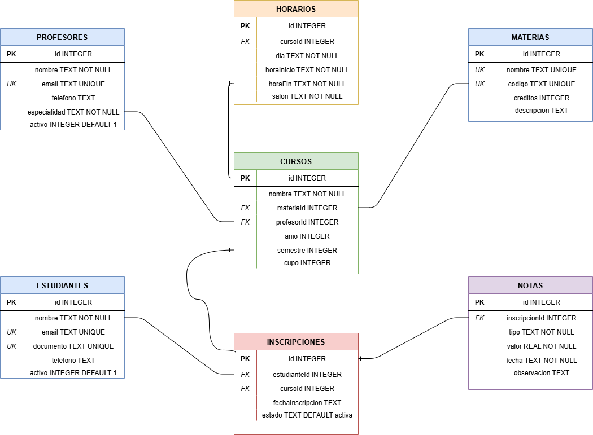

# 🎓 Sistema Educativo API

## Modelo de Datos (Diagrama ER)


API REST para gestión de un sistema educativo, construida con Node.js, Express y SQLite. Permite administrar profesores, materias, estudiantes, cursos, horarios, inscripciones y notas.

---

## 🌐 URL en producción

```
https://sistema-educativo-api.onrender.com
```

> ⚠️ El plan gratuito de Render suspende el servidor tras 15 minutos de inactividad. La primera petición puede tardar hasta 60 segundos (cold start). Esto es normal.

---

## 🔐 Autenticación

Todos los endpoints requieren el siguiente header en cada petición:

```
password: [tu_password]
```

| Código | Significado |
|--------|-------------|
| 401 | No se envió el header `password` |
| 403 | La contraseña es incorrecta |

---

## 🗂️ Modelo de datos (Diagrama ER)

```
profesores          materias
    │                  │
    │                  │
    └──────┬───────────┘
           ▼
         cursos
        /      \
       ▼        ▼
  horarios   inscripciones ──── estudiantes
                  │
                  ▼
               notas
```

### Tablas y relaciones

| Tabla | Descripción | Relaciones FK |
|-------|-------------|----------------|
| `profesores` | Docentes del sistema | — |
| `materias` | Asignaturas disponibles | — |
| `estudiantes` | Alumnos registrados | — |
| `cursos` | Instancia de una materia con profesor | → materias, → profesores |
| `horarios` | Días y horas de un curso | → cursos |
| `inscripciones` | Registro de estudiante en un curso | → estudiantes, → cursos |
| `notas` | Calificaciones por inscripción | → inscripciones |

---

## 📋 Endpoints por tabla

Todos los endpoints de lista (GET /) soportan filtros dinámicos por cualquier campo usando query params. Ejemplo: `GET /profesores?especialidad=Matemáticas`

---

### 👨‍🏫 Profesores `/profesores`

| Método | Ruta | Descripción |
|--------|------|-------------|
| GET | /profesores | Obtener todos los profesores |
| GET | /profesores/:id | Obtener un profesor por ID |
| POST | /profesores | Crear un profesor |
| PUT | /profesores/:id | Actualizar un profesor |
| DELETE | /profesores/:id | Eliminar un profesor |

**Campos POST/PUT:**
```json
{
  "nombre": "Ana García",
  "email": "ana@correo.com",
  "telefono": "3001234567",
  "especialidad": "Matemáticas",
  "activo": 1
}
```

---

### 📚 Materias `/materias`

| Método | Ruta | Descripción |
|--------|------|-------------|
| GET | /materias | Obtener todas las materias |
| GET | /materias/:id | Obtener una materia por ID |
| POST | /materias | Crear una materia |
| PUT | /materias/:id | Actualizar una materia |
| DELETE | /materias/:id | Eliminar una materia |

**Campos POST/PUT:**
```json
{
  "nombre": "Cálculo",
  "codigo": "MAT101",
  "creditos": 4,
  "descripcion": "Cálculo diferencial e integral"
}
```

---

### 🎓 Estudiantes `/estudiantes`

| Método | Ruta | Descripción |
|--------|------|-------------|
| GET | /estudiantes | Obtener todos los estudiantes |
| GET | /estudiantes/:id | Obtener un estudiante por ID |
| POST | /estudiantes | Crear un estudiante |
| PUT | /estudiantes/:id | Actualizar un estudiante |
| DELETE | /estudiantes/:id | Eliminar un estudiante |

**Campos POST/PUT:**
```json
{
  "nombre": "Carlos López",
  "email": "carlos@correo.com",
  "documento": "1234567890",
  "telefono": "3109876543",
  "activo": 1
}
```

---

### 🏫 Cursos `/cursos`

| Método | Ruta | Descripción |
|--------|------|-------------|
| GET | /cursos | Obtener todos los cursos |
| GET | /cursos/:id | Obtener un curso por ID |
| POST | /cursos | Crear un curso |
| PUT | /cursos/:id | Actualizar un curso |
| DELETE | /cursos/:id | Eliminar un curso |

**Campos POST/PUT:**
```json
{
  "nombre": "Cálculo I - Grupo A",
  "materiaId": 1,
  "profesorId": 1,
  "año": 2025,
  "semestre": 1,
  "cupo": 30
}
```

---

### 🕐 Horarios `/horarios`

| Método | Ruta | Descripción |
|--------|------|-------------|
| GET | /horarios | Obtener todos los horarios |
| GET | /horarios/:id | Obtener un horario por ID |
| POST | /horarios | Crear un horario |
| PUT | /horarios/:id | Actualizar un horario |
| DELETE | /horarios/:id | Eliminar un horario |

**Campos POST/PUT:**
```json
{
  "cursoId": 1,
  "dia": "Lunes",
  "horaInicio": "08:00",
  "horaFin": "10:00",
  "salon": "Aula 201"
}
```

> `dia` debe ser: `Lunes`, `Martes`, `Miercoles`, `Jueves`, `Viernes` o `Sabado`

---

### 📝 Inscripciones `/inscripciones`

| Método | Ruta | Descripción |
|--------|------|-------------|
| GET | /inscripciones | Obtener todas las inscripciones |
| GET | /inscripciones/:id | Obtener una inscripción por ID |
| POST | /inscripciones | Crear una inscripción |
| PUT | /inscripciones/:id | Actualizar una inscripción |
| DELETE | /inscripciones/:id | Eliminar una inscripción |

**Campos POST/PUT:**
```json
{
  "estudianteId": 1,
  "cursoId": 1,
  "fechaInscripcion": "2025-02-01",
  "estado": "activa"
}
```

> `estado` debe ser: `activa`, `cancelada` o `finalizada`

---

### 🏆 Notas `/notas`

| Método | Ruta | Descripción |
|--------|------|-------------|
| GET | /notas | Obtener todas las notas |
| GET | /notas/:id | Obtener una nota por ID |
| POST | /notas | Crear una nota |
| PUT | /notas/:id | Actualizar una nota |
| DELETE | /notas/:id | Eliminar una nota |

**Campos POST/PUT:**
```json
{
  "inscripcionId": 1,
  "tipo": "parcial1",
  "valor": 4.5,
  "fecha": "2025-03-15",
  "observacion": "Buen desempeño"
}
```

> `tipo` debe ser: `parcial1`, `parcial2`, `final`, `taller` o `proyecto`
> `valor` debe estar entre `0` y `5`

---

## ⚙️ Tecnologías utilizadas

- **Node.js** — Entorno de ejecución
- **Express** — Framework para la API REST
- **SQLite3** — Base de datos relacional ligera
- **dotenv** — Variables de entorno
- **nodemon** — Reinicio automático en desarrollo
- **Render** — Plataforma de despliegue en la nube

---

## 🚀 Instrucciones para correr localmente

### 1. Clonar el repositorio
```bash
git clone https://github.com/robledocordoba123-cmyk/sistema-educativo-api.git
cd sistema-educativo-api
```

### 2. Instalar dependencias
```bash
npm install
```

### 3. Crear el archivo `.env`
```
PORT=3000
API_PASSWORD=TuPasswordSegura2024
```

### 4. Iniciar en modo desarrollo
```bash
npm run dev
```

La API estará disponible en `http://localhost:3000`

### 5. Probar con Postman
Importar la colección incluida en el repositorio y usar el header `password` con el valor configurado en `.env`.

---

## 📁 Estructura del proyecto

```
sistema-educativo-api/
├── index.js          # Punto de entrada, middleware y registro de rutas
├── db.js             # Conexión a SQLite y creación de las 7 tablas
├── .env              # Variables de entorno (no subido a GitHub)
├── .gitignore        # Excluye node_modules, database.db y .env
├── package.json      # Dependencias y scripts
└── routes/
    ├── profesores.js
    ├── materias.js
    ├── estudiantes.js
    ├── cursos.js
    ├── horarios.js
    ├── inscripciones.js
    └── notas.js
```
